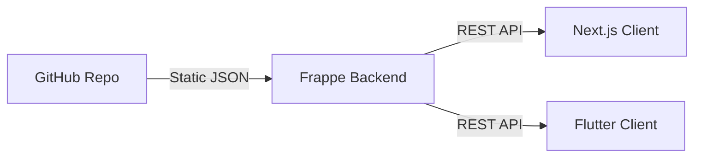

# Architecture Guide: Consuming the Shoprite API via Frappe

This repository serves as the **Data Source** for Shoprite product information. It implements a static publication pipeline that is consumed by a Frappe backend, which in turn serves the data to Next.js and Flutter clients.

> **IMPORTANT**: Clients (Next.js, Flutter, etc.) should **never** fetch data directly from this GitHub repository. Always use the Frappe REST API.

## Architecture Overview



1. **GitHub Repo**: Scrapes data, maintains markdown cards, and publishes static `meta.json` and product detail JSONs.
2. **Frappe Backend**: A scheduled sync job monitors this repository.
3. **Clients**: Consume structured, validated data from the Frappe REST API.

---

## Frappe Sync Strategy

The Frappe backend maintains a local mirror of the product data using the following optimized strategy:

1. **Scheduled Sync**: A background job runs on the Frappe server (e.g., every 6 hours).
2. **Hash Comparison**: The job fetches `published/meta.json` from this repository and compares its `content_hash` with the hash from the previous sync.
3. **Selective Update**:
    - If hashes match: The job terminates immediately (no changes).
    - If hashes differ: The job iterates through the `products` index and only fetches individual `products/{slug}/{slug}.json` files for products that are new or have updated metadata.

---

## REST Endpoints (Frappe)

### 1. Product Listing
- **URL**: `/api/resource/Shoprite Product`
- **Fields**: `name` (slug), `product_id`, `item_name`, `current_price`, `category`, `thumbnail`

### 2. Product Detail
- **URL**: `/api/resource/Shoprite Product/{slug}`
- **Purpose**: Returns the full product data including nutrition, specifications, and images.

---

## Sample Fetch Functions (Next.js)

```typescript
const FRAPPE_URL = 'https://your-frappe-instance.com';

// Fetching Product Listing with Filters
async function getProducts(category?: string) {
  const params = new URLSearchParams({
    fields: JSON.stringify(["name", "item_name", "current_price", "thumbnail"]),
    filters: category ? JSON.stringify([["category", "=", category]]) : "[]"
  });
  const res = await fetch(`${FRAPPE_URL}/api/resource/Shoprite Product?${params}`);
  return res.json();
}

// Fetching a Single Product Detail
async function getProductDetail(slug: string) {
  const res = await fetch(`${FRAPPE_URL}/api/resource/Shoprite Product/${slug}`);
  return res.json();
}

// Search by Barcode
async function getProductByBarcode(barcode: string) {
  const params = new URLSearchParams({
    filters: JSON.stringify([["barcode", "=", barcode]])
  });
  const res = await fetch(`${FRAPPE_URL}/api/resource/Shoprite Product?${params}`);
  return res.json();
}
```

---

## Data Shape

The data shape remains consistent with the publication format of this repository, mapped to Frappe DocFields.

### Product Detail Example
```json
{
  "name": "blue-ribbon-sliced-white-bread-700g",
  "product_id": "10136370",
  "item_name": "Blue Ribbon Sliced White Bread 700g",
  "category": "Bread-and-Rolls",
  "current_price": 19.99,
  "description": "Consistently delivering the taste and quality you expect...",
  "ingredients": "Wheat Flour, Water...",
  "barcode": "6001234567890",
  "is_platform": 0,
  "nutrition": [
    {
      "nutrient": "Carbohydrates",
      "per_100g": "50g",
      "per_serving": "75g"
    }
  ],
  "images": [
    { "image": "/files/blue-ribbon-sliced-white-bread-700g_0.jpg" }
  ]
}
```

---

## Image Serving

Images are stored in the Frappe File Manager during the sync process.

- **Storage**: Images are downloaded from GitHub and attached to the `Shoprite Product` document.
- **URL Pattern**: `/files/{filename}.jpg`
- **Consumption**: Next.js and Flutter clients should use the `thumbnail` or `images` fields directly as relative paths from the Frappe base URL.

Example: `https://your-frappe-instance.com/files/blue-ribbon-sliced-white-bread-700g_0.jpg`
